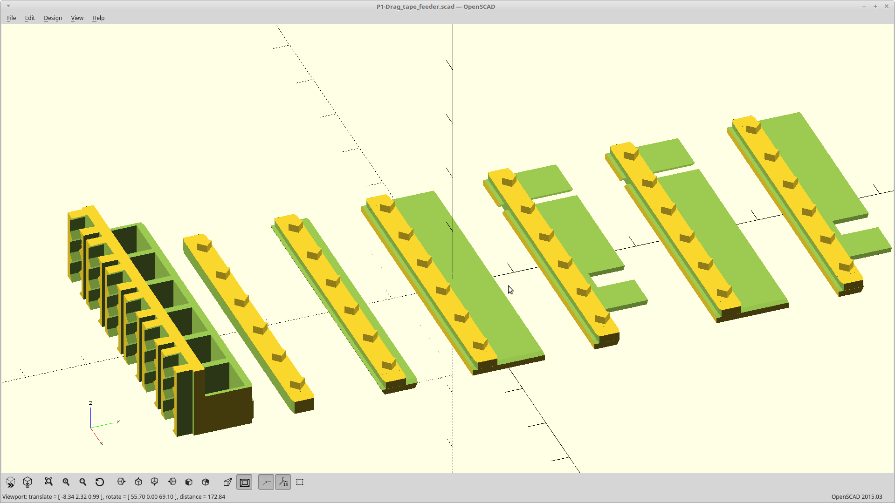
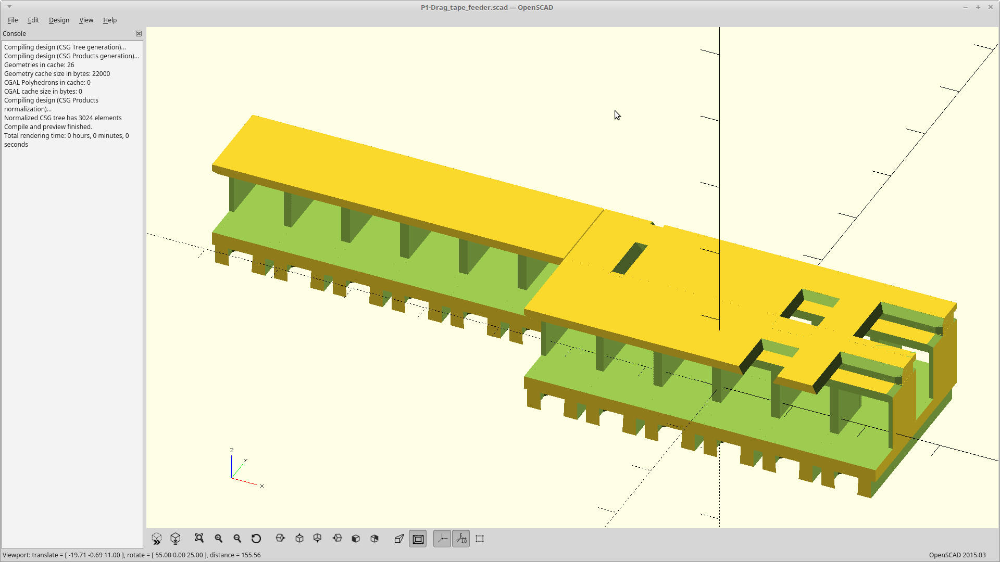

## P1-Drag-tape-feeder

This project is a modular 3D printable Lego compatible drag feeder for pick and place machines. 

Lego pins are spaced at exactly 8mm.  SMT tapes come in increments of 4mm. 
This mounting system is designed to snap to a Lego sheet at full or half widths, which then gives you an indexed solution for 4mm widths.  
This lets you pick any required tape width and quickly and accurately build a custom feeder, using a Lego base sheet. 

Each component block is printed as two parts and then snapped or glued together.  The base controls the maximum tape depth you want to support, and the covers let you choose whatever configuration you want.

The [Arcus-3D-P1 Drag tape feeder](https://hackaday.io/project/160857) is open source hardware. This github repository hosts the [OpenSCAD](http://www.openscad.org) source and the rendered STL images for quick access.

If you are the 'blazing forward without instructions' type, the minimum you need to know is: Print these STL files using a 0.3mm nozzle on a relatively well tuned 3D printer. For further instructions and caveats, see [the web page](https://hackaday.io/project/160857).

Hardware designs (schematics and CAD) files are licensed under the [Creative Commons Attribution-ShareAlike 3.0 Unported License](http://creativecommons.org/licenses/by-sa/3.0/) and follow the terms of the [OSHW (Open-source hardware) Statement of Principles 1.0.](http://freedomdefined.org/OSHW)

